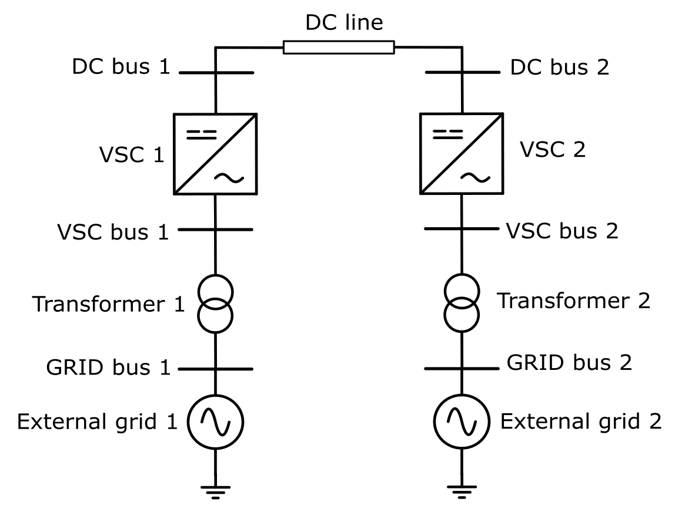
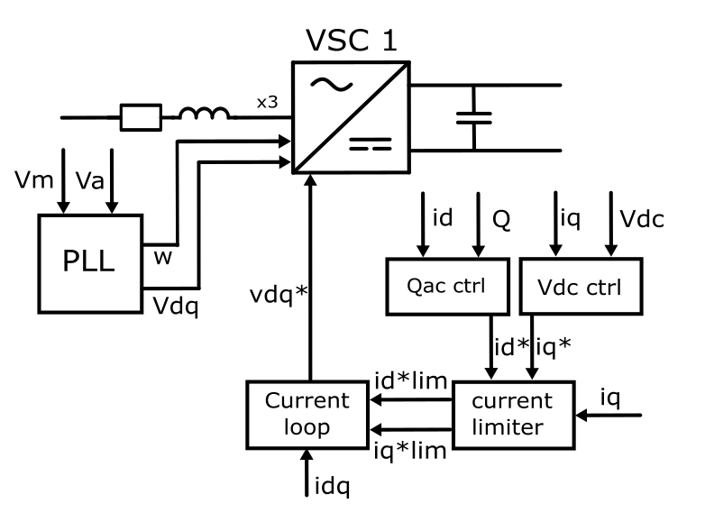
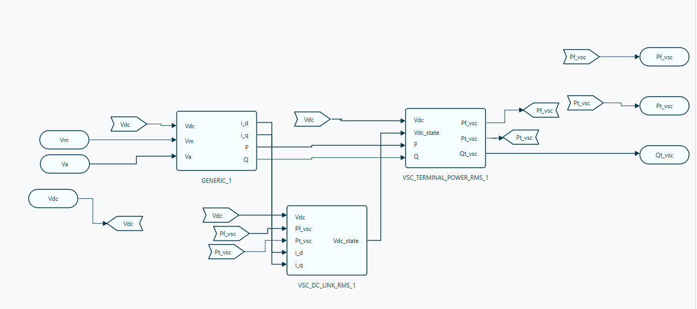
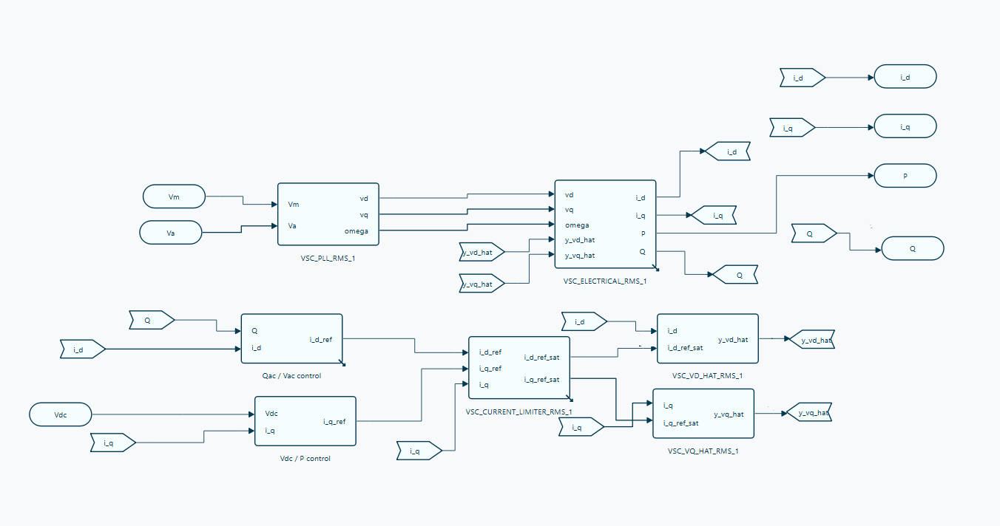

# A Hands-on Open-source Dynamic Simulation tutorial using VeraGrid

## Guide contents

1. [eRoots Analytics, VeraGrid and session context](#1-eroots-analytics-veragrid-and-session-context)
   1. [Who we are](#11-who-we-are)
   2. [What is VeraGrid?](#12-what-is-veragrid)
   3. [Purpose of the session](#13-purpose-of-the-session)
   4. [Repository files and session roadmap](#14-repository-files-and-session-roadmap)
2. [Learning objectives](#2-learning-objectives)
3. [System overview](#3-system-overview)
   1. [Network topology](#31-network-topology)
   2. [Control philosophy](#32-control-philosophy)
   3. [Modelling conventions and bases](#33-modelling-conventions-and-bases)
4. [Static network data](#4-static-network-data)
   1. [Grid and buses](#41-grid-and-buses)
   2. [External AC grids](#42-external-ac-grids)
   3. [Coupling transformers](#43-coupling-transformers)
   4. [Voltage-source converters](#44-voltage-source-converters)
   5. [DC line](#45-dc-line)
5. [Add the RMS models](#5-add-the-rms-models)
   1. [Open the starting case and identify the devices](#51-open-the-starting-case-and-identify-the-devices)
   2. [Model assignment summary](#52-model-assignment-summary)
   3. [Add default catalogue and assign RMS templates](#53-add-default-catalogue-and-assign-rms-templates)
   4. [Single-block models in the RMS editor](#54-single-block-models-in-the-rms-editor)
   5. [DC-line model and parameter checks](#55-dc-line-model-and-parameter-checks)
6. [Build VSC1 from smaller blocks](#6-build-vsc1-from-smaller-blocks)
   1. [General VSC1 structure](#61-general-vsc1-structure)
   2. [Control scheme inside Generic](#62-control-scheme-inside-generic)
   3. [Parameters and initialization](#63-parameters-and-initialization)
   4. [Validate and save the assembled system](#64-validate-and-save-the-assembled-system)
7. [Power flow and first RMS simulation](#7-power-flow-and-first-rms-simulation)
8. [Add the RMS event and simulate again](#8-add-the-rms-event-and-simulate-again)
9. [Small-Signal RMS analysis](#9-small-signal-rms-analysis)
10. [Results and expected response](#10-results-and-expected-response)
11. [Troubleshooting](#11-troubleshooting)
12. [Final checklist](#12-final-checklist)

---

## 1. eRoots Analytics, VeraGrid and session context

### 1.1. Who we are

eRoots Analytics is a Barcelona-based spin-off of the Universitat Politècnica de Catalunya (UPC), founded in 2022. The company develops and commercializes advanced tools and services for electrical-power-system modelling, simulation and decision support.

The eRoots team brings together power-system engineers and software developers with experience in grid modelling, renewable-energy integration, energy markets and numerical methods. Its work follows three connected activities:

1. **Data:** cleaning, validating and organizing fragmented energy data into trusted datasets suitable for modelling and simulation.
2. **Algorithms:** developing open-source and high-performance methods for energy-system and electrical-grid studies.
3. **Insights:** translating complex study results into clear technical information that supports engineering and business decisions.

This scope extends across both time and system scale: from electromagnetic phenomena that occur within microseconds to planning scenarios that extend decades into the future, and from individual electrical components to large interconnected grids.

VeraGrid is the central open-source platform developed by eRoots. The company also provides engineering support, model development, data processing and validated studies for grid operators, utilities, manufacturers, engineering companies and research organizations.

### 1.2. What is VeraGrid?

VeraGrid is an open-source platform for modelling, analysing and visualizing electrical and energy systems. It is designed to support the complete grid-study workflow within a common data model, from high-level aggregated energy scenarios to detailed electrical-network representations.

Its principal characteristics are:

- **Open-source development:** the source code, modelling methods and interfaces can be inspected, extended and validated by users and contributors.
- **End-to-end workflow:** the same project can contain network data, time variations, study configurations, events and results without requiring a separate model for every analysis stage.
- **Interoperability:** VeraGrid can exchange data with commonly used grid formats and can be integrated into wider engineering workflows.
- **GUI and library access:** studies can be created interactively in the graphical user interface or automated through the VeraGrid Python library. Both interfaces operate on the same underlying network model.
- **Scalable modelling:** the platform is intended for both small educational examples and large practical networks.

VeraGrid covers three broad study areas:

| Area | Representative capabilities |
|---|---|
| Energy and market modelling | Investment analysis, adequacy, sector coupling, dispatch and optimal power flow |
| Static and time-series grid studies | Power flow, contingency analysis, short circuits and time-series simulations |
| Dynamic simulation | Small-Signal stability, RMS time-domain simulation and EMT simulation |

The graphical interface allows users to create multiple schematics and maps, inspect interactive result displays, manage device and template databases, and configure simulations without writing code. The Python library exposes the same modelling and calculation capabilities for reproducible studies, batch processing and automation.

This hands-on session focuses on RMS dynamic simulation and RMS Small-Signal analysis in VeraGrid. Participants will start from the supplied static network and add its dynamic models from the GUI.

### 1.3. Purpose of the session

This session starts from [LFE_HVDC_static.veragrid](system/LFE_HVDC_static.veragrid), which already contains the static point-to-point HVDC network. We will keep that network and add the RMS models to its devices. There is no need to redraw the static system or run a Python script.

The system contains two independent AC grids connected through a detailed DC link. Each terminal uses a grid-following voltage-source converter (GFL VSC). **VSC1 controls DC voltage; VSC2 controls transferred DC power.** Both regulate their AC reactive-power exchange.

We will learn two ways to assign dynamics: reusable `rms_template` models imported with **Add default catalogue**, and models built in the **RMS editor**. The transformers and DC line demonstrate catalogue assignment. The grid sources and VSC2 each require one complete block to drag and connect in the editor. **VSC1 is the exception: we will assemble it from smaller blocks**, including a control subsystem inside a `Generic` block.

This guide and the supporting files are kept together in the **LFE_dynamics** repository so that participants can follow the demonstration, recover a missed step and revisit the exercise afterwards.

### 1.4. Repository files and session roadmap

Download or clone the repository shared for the session, keeping its folder structure. See the [README](README.md) for access to VeraGrid on a local machine or the workshop browser desktop. If using the browser desktop, make the case files available in that desktop's filesystem before opening them in VeraGrid.

| Repository file | Purpose |
|---|---|
| [system/LFE_HVDC_static.veragrid](system/LFE_HVDC_static.veragrid) | Starting network: open this file and save a personal working copy |
| [system/LFE_HVDC_RMScomplete.veragrid](system/LFE_HVDC_RMScomplete.veragrid) | Completed reference: inspect its device models if you need to check a connection or catch up |
| [pics/example_hvdcLFE.png](pics/example_hvdcLFE.png) | Static network topology |
| [pics/vsc_structure.png](pics/vsc_structure.png) | Functional overview of VSC1 and its control loops |
| [pics/general_structure_hvdc.png](pics/general_structure_hvdc.png) | Top-level structure to assemble for VSC1 |
| [pics/control_scheme_veragrid.png](pics/control_scheme_veragrid.png) | Control scheme to assemble inside VSC1's `Generic` block |

Keep the supplied cases unchanged and save your work under a different filename. The completed case includes an event and saved study results; these do not replace running the studies on your own assembled model. If you use it to catch up, remove its event from your working copy before the first, undisturbed RMS run.

**Session order:** open the static case → assign catalogue RMS templates → add the single-block models → build VSC1 → run **Power Flow** → run **RMS simulation without events** → add one **RmsEvent** on VSC2's `Pref` (`P_ref` in the model), from **0.20 to 0.19 p.u. at 5 s** → run **RMS simulation again** → run **Small-Signal RMS**.

## 2. Learning objectives

At the end of the session, participants should be able to:

- distinguish an AC bus from a DC bus in VeraGrid;
- identify the devices and connections of the supplied point-to-point HVDC network;
- select compatible converter controls for an AC/DC power flow;
- understand why one HVDC terminal regulates DC voltage and the other regulates active power;
- import RMS templates through **Add default catalogue** and assign them to devices;
- drag and connect complete device blocks in the RMS editor;
- assemble VSC1 from smaller blocks and understand the hierarchy inside `Generic`;
- identify the PLL, outer controls, limiter, current controllers and DC-link dynamics;
- define an event on a dynamic reference rather than on a static device property;
- run a baseline RMS study, add the power-reference step and compare a second run;
- run RMS Small-Signal analysis and inspect modes, damping and participation factors;
- interpret the sign and per-unit conventions of the principal results.

## 3. System overview

### 3.1. Network topology

The network is symmetrical at both terminals. The detailed connection order is:



*Figure 1. Static point-to-point HVDC network supplied for the session.*

The tables retain descriptive identifiers from the original guide. Use the following mapping to find the actual objects in the supplied files; no renaming is required.

| Guide identifier | Name in the supplied files |
|---|---|
| `Bus_Grid_1`, `Bus_VSC_1`, `Bus_DC_1` | `Bus1_grid`, `Bus1_vsc`, `Bus1_dc` |
| `Bus_Grid_2`, `Bus_VSC_2`, `Bus_DC_2` | `Bus2_grid`, `Bus2_vsc`, `Bus2_dc` |
| `Generator_Grid_1`, `Generator_Grid_2` | `gen@Bus 0`, `gen@Bus 5` |
| `TrafoGFL_1`, `TrafoGFL_2` | Both named `Transformer`; distinguish them by their connected buses |
| `VSC_1` / VSC1, `VSC_2` / VSC2 | `VSC 1`, `VSC 2` |
| `HVDC_Line` | `Dc line 1` |

The device directions in the supplied network are:

| Device | `from` bus | `to` bus |
|---|---|---|
| `TrafoGFL_1` | `Bus_Grid_1` | `Bus_VSC_1` |
| `VSC_1` | `Bus_DC_1` | `Bus_VSC_1` |
| `HVDC_Line` | `Bus_DC_1` | `Bus_DC_2` |
| `VSC_2` | `Bus_DC_2` | `Bus_VSC_2` |
| `TrafoGFL_2` | `Bus_VSC_2` | `Bus_Grid_2` |

For a VeraGrid `VSC`, the positive DC terminal is always the `from` side and the AC terminal is always the `to` side. The GUI may correct a reversed drawing automatically, but the final properties must still be checked.

> **Important:** use a physical `DcLine` between the two DC buses. Do not use the aggregated `HvdcLine` device. The exercise represents converters, DC buses and the DC line explicitly.

### 3.2. Control philosophy

Every VSC must contribute two independent control equations to the AC/DC power flow. The selected controls are:

| Converter | Active-axis control | Reactive-axis control | Role in the HVDC link |
|---|---|---|---|
| `VSC_1` | `Vm_dc` | `Qac` | Establishes the DC-voltage reference and acts as the DC slack terminal |
| `VSC_2` | `Pdc` | `Qac` | Establishes the transferred DC power |

This allocation is fundamental. A connected DC island requires one DC-voltage controller. If neither terminal controls `Vm_dc`, the DC voltage has no reference. If both terminals impose the same DC-voltage degree of freedom, the model is over-constrained.

The two AC grids are separate AC islands connected only through the converter-based DC system. Each AC island therefore has its own slack bus and stiff voltage-source equivalent.

### 3.3. Modelling conventions and bases

| Quantity | Value | Use |
|---|---:|---|
| System base power, `Sbase` | 100 MVA | Common base for all per-unit powers and impedances |
| Nominal frequency, `fBase` | 50 Hz | AC nominal frequency and PLL base |
| AC nominal voltage | 90 kV | All four AC buses |
| DC nominal voltage | 145 kV | Both DC buses |
| AC impedance base, `Zbase_ac` | 81 ohm | `90^2 / 100` |
| DC impedance base, `Zbase_dc` | 210.25 ohm | `145^2 / 100` |

Unless a static property explicitly states MW, MVAr, MVA or kV, dynamic quantities in this exercise are expressed in per unit on the 100 MVA system base.

Useful conversions are:

- `1.0 p.u.` active power = `100 MW`;
- `0.20 p.u.` active power = `20 MW`;
- `0.01 p.u.` active-power change = `1 MW`;
- `1.0 p.u.` AC voltage = `90 kV`;
- `1.0 p.u.` DC voltage = `145 kV`.

## 4. Static network data

### 4.1. Grid and buses

The supplied circuit is named `LFE_HVDC_RMS`. The following tables explain the existing static data; they are reference checks, not instructions to create another network.

| Object | Parameter | Value | Meaning |
|---|---|---:|---|
| Grid | `Sbase` | 100 MVA | System power base |
| Grid | `fBase` | 50 Hz | Nominal frequency |
| `Bus_Grid_1` | `Vnom` | 90 kV | AC-grid terminal voltage |
| `Bus_Grid_1` | `is_dc` | `False` | AC bus |
| `Bus_Grid_1` | `is_slack` | `True` | Angle and voltage reference of AC island 1 |
| `Bus_VSC_1` | `Vnom` | 90 kV | Converter-side AC bus |
| `Bus_VSC_1` | `is_dc` | `False` | AC bus |
| `Bus_VSC_1` | `is_slack` | `False` | Non-slack AC bus |
| `Bus_DC_1` | `Vnom` | 145 kV | DC terminal 1 |
| `Bus_DC_1` | `is_dc` | `True` | DC bus |
| `Bus_DC_1` | `is_slack` | `False` | DC voltage is controlled by `VSC_1`, not by the bus flag |
| `Bus_DC_2` | `Vnom` | 145 kV | DC terminal 2 |
| `Bus_DC_2` | `is_dc` | `True` | DC bus |
| `Bus_DC_2` | `is_slack` | `False` | DC voltage follows the link solution |
| `Bus_VSC_2` | `Vnom` | 90 kV | Converter-side AC bus |
| `Bus_VSC_2` | `is_dc` | `False` | AC bus |
| `Bus_VSC_2` | `is_slack` | `False` | Non-slack AC bus |
| `Bus_Grid_2` | `Vnom` | 90 kV | AC-grid terminal voltage |
| `Bus_Grid_2` | `is_dc` | `False` | AC bus |
| `Bus_Grid_2` | `is_slack` | `True` | Angle and voltage reference of AC island 2 |

The usual voltage limits may remain at their defaults of `Vmin = 0.9 p.u.` and `Vmax = 1.1 p.u.`.

### 4.2. External AC grids

One generator injection is already attached to each grid bus.

| Device | Bus | Parameter | Value |
|---|---|---|---:|
| `Generator_Grid_1` | `Bus_Grid_1` | `P` | 0 MW |
| `Generator_Grid_1` | `Bus_Grid_1` | `Vset` | 1.0 p.u. |
| `Generator_Grid_1` | `Bus_Grid_1` | `Snom` | 100 MVA |
| `Generator_Grid_1` | `Bus_Grid_1` | `freq` | 50 Hz |
| `Generator_Grid_1` | `Bus_Grid_1` | `R1` | 0.039644 p.u. |
| `Generator_Grid_1` | `Bus_Grid_1` | `X1` | 0.134925 p.u. |
| `Generator_Grid_2` | `Bus_Grid_2` | Same values | Same values |

The stored sequence values are rounded from the conversion:

```text
R1 = (4.8 * 0.669) / Zbase_ac
X1 = (2 * pi * 50 * 0.052 * 0.669) / Zbase_ac
```

In this particular RMS study, the dynamic voltage-source block directly fixes the grid-bus voltage magnitude and angle while its active- and reactive-power limits are not reached. Consequently, `R1` and `X1` are retained as source-device data but are not the coupling impedance used by that ideal voltage-source RMS block. The explicit coupling impedance is provided by `TrafoGFL_1` and `TrafoGFL_2`.

### 4.3. Coupling transformers

Both transformers are ordinary passive two-winding transformer devices. Despite the historical `TrafoGFL` name, they do not contain the converter controller.

| Device | Parameter | Value | Meaning |
|---|---|---:|---|
| `TrafoGFL_1` | `rate` | 100 MVA | Operational rating |
| `TrafoGFL_1` | `R` | 0.01 p.u. | Series resistance |
| `TrafoGFL_1` | `X` | 0.05 p.u. | Series reactance |
| `TrafoGFL_1` | `tap_module` | 1.0 p.u. | Fixed tap magnitude |
| `TrafoGFL_1` | `tap_phase` | 0 rad | Fixed phase shift |
| `TrafoGFL_1` | `HV` / `LV` | 90 / 90 kV | No voltage-ratio change |
| `TrafoGFL_2` | Same values | Same values | Symmetrical terminal |

The transformers provide the station resistance and reactance. The standalone VSC model therefore uses zero internal converter resistance for this example to avoid duplicating losses.

### 4.4. Voltage-source converters

| Device | Parameter | Value | Units and purpose |
|---|---|---:|---|
| `VSC_1` | `rate` | 100 | MVA rating |
| `VSC_1` | `control1` | `Vm_dc` | DC-voltage control |
| `VSC_1` | `control1_val` | 1.0 | p.u. DC-voltage target |
| `VSC_1` | `control2` | `Qac` | AC reactive-power control |
| `VSC_1` | `control2_val` | 0.0 | MVAr target in the static power flow |
| `VSC_1` | `alpha1` | 0.0 | Constant converter-loss coefficient |
| `VSC_1` | `alpha2` | 0.0 | Linear converter-loss coefficient |
| `VSC_1` | `alpha3` | 0.0 | Quadratic converter-loss coefficient |
| `VSC_2` | `rate` | 100 | MVA rating |
| `VSC_2` | `control1` | `Pdc` | DC active-power control |
| `VSC_2` | `control1_val` | 20.0 | MW target in the static power flow |
| `VSC_2` | `control2` | `Qac` | AC reactive-power control |
| `VSC_2` | `control2_val` | 0.0 | MVAr target in the static power flow |
| `VSC_2` | `alpha1` | 0.0 | Constant converter-loss coefficient |
| `VSC_2` | `alpha2` | 0.0 | Linear converter-loss coefficient |
| `VSC_2` | `alpha3` | 0.0 | Quadratic converter-loss coefficient |

`control1_val` follows the units of the selected control. Enter `1.0` for the `Vm_dc` voltage target, but enter `20.0`, not `0.20`, for the static `Pdc` target because the static GUI property is in MW.

The loss coefficients are set to zero so that the power balance remains easy to inspect. The physical losses retained in the example are the transformer series losses and the DC-line resistive loss.

### 4.5. DC line

| Device | Parameter | Value | Meaning |
|---|---|---:|---|
| `HVDC_Line` | `rate` | 100 MVA | Operational rating |
| `HVDC_Line` | `R` | 0.01 p.u. | Static DC-line resistance for this session |
| `HVDC_Line` | `from` | `Bus_DC_1` | Sending-side DC bus |
| `HVDC_Line` | `to` | `Bus_DC_2` | Receiving-side DC bus |

With the DC impedance base, this corresponds to:

```text
R_dc = 0.01 p.u.
R_dc_ohm = 0.01 * Zbase_dc = 0.01 * 210.25 = 2.1025 ohm
```

Only `R` is part of the static `DcLine` device. The series dynamic coefficient `l_dc = 0.05 p.u.` is introduced in the RMS model described in Section 5.5.

## 5. Add the RMS models

### 5.1. Open the starting case and identify the devices

1. Open `system/LFE_HVDC_static.veragrid` in VeraGrid and use **Save as** to create your working copy.
2. Identify the devices using the topology and name mapping in Section 3.1.
3. Check the data in Section 4, especially `Sbase = 100 MVA`, `fBase = 50 Hz`, the converter controls and `Dc line 1.R = 0.01 p.u.`.
4. Confirm the object count below. Keep the existing network connections and the automatically supplied RMS connection shells.

| Object type | Expected count |
|---|---:|
| Buses | 6: four AC and two DC |
| Generators representing external grids | 2 |
| Two-winding transformers | 2 |
| VSCs | 2 |
| Physical DC lines | 1 |
| Loads / aggregated HVDC lines | 0 / 0 |

The bus connection shells provide `Vm` and `Va` on AC buses and `Vdc` on DC buses. They do not replace the device dynamics that we will add. The first study in the session comes **after all device models have been assembled**.

### 5.2. Model assignment summary

| Device | How we will add its RMS model | Model and purpose |
|---|---|---|
| `TrafoGFL_1`, `TrafoGFL_2` | **Add default catalogue**, then assign `rms_template` | Passive `2W Transformer` template |
| `HVDC_Line` | **Add default catalogue**, then assign `rms_template` | `DC line`: series R-L dynamics |
| `Generator_Grid_1`, `Generator_Grid_2` | RMS editor: drag and connect **one block per device** | `Voltage source`: stiff external AC grid |
| `VSC_2` | RMS editor: drag and connect **one complete block** | `Complete GFL VSC hvdc`, configured for `Pdc/Qac` |
| `VSC_1` | RMS editor: **assemble smaller blocks** | `Generic` control subsystem, terminal-power equations and DC-link capacitor, configured for `Vm_dc/Qac` |

"One block" means one device model placed on the canvas, in addition to the network connection ports. A complete block can contain internal equations and sub-blocks; we do not rebuild those internals for the sources or VSC2.

### 5.3. Add default catalogue and assign RMS templates

1. Open **Actions → Add default catalogue**.
2. Expand **RMS model templates**. Select **2W Transformer** and **DC line**, then accept the selection. These are dynamic templates; the separate **Transformer types** category contains static equipment data and is not the category used here.
3. In the device properties/database table, assign the imported transformer template to the **`rms_template`** property of each transformer.
4. Assign the imported `DC line` template to **`HVDC_Line.rms_template`** (`Dc line 1` in the file).
5. Check the assignments and inspect their RMS models/terminal mappings. The transformer model must use the actual from/to buses; the DC-line model must use both DC terminal voltages.
6. Save the working circuit.

**Importing a template only adds it to the circuit catalogue. Assigning `rms_template` connects that template to a particular device.** Complete both steps. Do not add another independent model to the same device on top of the assigned template.

The transformer template reads the static resistance/reactance and tap data and calculates `Pf`, `Qf`, `Pt` and `Qt`. It contains no converter controller. Keep the transformers passive: the converter controls belong to the VSCs.

### 5.4. Single-block models in the RMS editor

For each generator and for VSC2:

1. Open the device's **RMS editor** from its context menu.
2. Keep the existing network connection ports.
3. Drag the required complete model from the contextual **Library → Devices** branch.
4. Connect each input and output to the matching network port, using the signal names and terminal mappings rather than just the drawing position.
5. Inspect **Block Properties**, apply the changes and save the complete model back to the device. Save the circuit too.

Use the following connections:

| Device block | Inputs from the network | Outputs back to the network |
|---|---|---|
| `Voltage source` on each generator | `Vm`, `Va` of its grid bus | `P`, `Q` at that bus |
| `Complete GFL VSC hvdc` on VSC2 | `Vdc` at `Bus_DC_2`; `Vm`, `Va` at `Bus_VSC_2` | DC-side `Pf`, AC-side `Pt` and `Qt`, using the matching VSC terminal slots |

The VSC power signals may be labelled `Pf_vsc`, `Pt_vsc` and `Qt_vsc` in the diagram. Match them to their DC-from and AC-to terminal meanings.

For **VSC2**, select `control1 = Pdc`, `control2 = Qac` and `cdc = 0.40` in the complete block's structural properties. Check the controller parameters in Section 6.3. In some saved diagrams the complete block is named `HVDC GFL VSC explicit PI`.

For the **external grids**, use `Voltage source`, not a complete synchronous-generator model. The voltage reference `Vg0` and angle reference `Ag0` initialize from power flow. The reference source has wide active/reactive limits, `Pmax_G = Qmax_G = 9.999 p.u.` and `Pmin_G = Qmin_G = -9.999 p.u.`; within those limits it holds the AC-grid voltage and angle fixed while power exchange follows the network.

**Checkpoint:** both transformers and the DC line have assigned templates; both grid sources and VSC2 have saved complete models. VSC1 remains to be built in Section 6.

### 5.5. DC-line model and parameter checks

The catalogue's **DC line** model contains an explicit current state. Inspect it to understand what the template adds; there is no need to type its equations manually in this session.

| Symbol | Role | Value or connection |
|---|---|---|
| `Vdcf`, `Vdct` | Terminal-voltage inputs | `Bus_DC_1.Vdc`, `Bus_DC_2.Vdc`, respectively |
| `If_dc` | Current state, available in results | Positive from DC bus 1 to DC bus 2 |
| `Pf`, `Pt` | Terminal-power outputs | From-side and to-side power |
| `r_dc` | Static parameter mapping | Read from the line resistance: `0.01 p.u.` |
| `l_dc` | Editable dynamic parameter | `0.05 p.u.` |

```text
dIf_dc/dt = (Vdcf - Vdct - r_dc * If_dc) / l_dc
Pf = Vdcf * If_dc
Pt = -Vdct * If_dc
```

The template maps `Vdcf` and `Vdct` to branch-side `Vmf` and `Vmt` references; the connected DC buses supply the actual `Vdc` values. `If_dc`, `Pf` and `Pt` are initialized from power flow. The current is an internal state; it does not need an extra wire to another device. Connect the two terminal-power outputs.

`r_dc` follows the static device resistance and must not be given an unrelated value. `l_dc` has no static-device counterpart and is edited in the dynamic model. It remains unchanged during our power-reference event.

## 6. Build VSC1 from scratch with all the control blocks

VSC1 uses the same physical control functions as a complete HVDC GFL VSC, but we will build the hierarchy ourselves. Start with the functional overview below before translating the control loops into RMS editor blocks.



*Figure 2. VSC1 and its control loops: synchronization, reactive-power and DC-voltage regulation, current limiting and inner current control.*

The PLL uses the AC voltage magnitude and angle (`Vm`, `Va`) to obtain the rotating-frame quantities. The Qac and Vdc controllers produce the d-axis and q-axis current references, respectively. These references pass through the current limiter before the inner current loop generates the converter voltage commands. The capacitor on the DC side provides the DC-link energy storage represented in the RMS model.

The next two figures show how to implement this structure in VeraGrid. Inspect `VSC 1` in [LFE_HVDC_RMScomplete.veragrid](system/LFE_HVDC_RMScomplete.veragrid) when you need to check a port or parameter.

### 6.1. General VSC1 structure



*Figure 3. Top-level structure to assemble in the RMS editor of VSC1. The internals of `GENERIC_1` are shown in Figure 4.*

1. Open the RMS editor for **VSC 1** and keep its network connection ports.
2. Add a **Generic** block for the converter controls and electrical equations. Its interface must have inputs `Vdc`, `Vm`, `Va` and outputs `i_d`, `i_q`, `P`, `Q`.
3. Add **DC-link capacitor** (`VSC_DC_LINK_RMS_1` in the figure).
4. Add **VSC terminal power equations** (`VSC_TERMINAL_POWER_RMS_1` in the figure).
5. Build the connections below. Then enter `Generic` and assemble its contents as described in Section 6.2.

| Source | Destination |
|---|---|
| Network `Vm`, `Va` from the AC side of VSC1 | `Generic.Vm`, `Generic.Va` |
| Network `Vdc` from the DC side of VSC1 | `Generic.Vdc`, DC-link `Vdc`, terminal-power `Vdc` |
| `Generic.i_d`, `Generic.i_q` | DC-link `i_d`, `i_q` |
| `Generic.P`, `Generic.Q` | Terminal-power `P`, `Q` |
| DC-link `Vdc_state` | Terminal-power `Vdc_state` |
| Terminal-power `Pf_vsc`, `Pt_vsc` | Corresponding VSC network power ports **and** DC-link `Pf_vsc`, `Pt_vsc` feedback inputs |
| Terminal-power `Qt_vsc` | VSC AC-side reactive-power port |

The DC-link block owns the capacitor state. The terminal-power block couples that state and the converter powers to the network. Keep network `Vdc` and capacitor `Vdc_state` as the separate signals shown in the figure; do not omit either connection or add a second capacitor model.

The arrow-shaped named connectors in the figures route signals without long wires. They must refer to the same signal, not merely have similar labels. Direct wires are also valid if they preserve the connections above.

### 6.2. Control scheme inside Generic



*Figure 4. Contents of `GENERIC_1`. In this implementation, the Qac loop supplies the d-axis current reference and the Vdc loop supplies the q-axis reference.*

Enter the `Generic` block's internal diagram and expose the three inputs and four outputs defined in Section 6.1. Use the contextual Library to add these seven functional blocks:

| Library block | Name shown in the figure | Function/configuration for VSC1 |
|---|---|---|
| `PLL explicit PI` | `VSC_PLL_RMS_1` | Convert `Vm`, `Va` to `vd`, `vq`, `omega` in the converter frame |
| `Converter electrical equations` | `VSC_ELECTRICAL_RMS_1` | Calculate converter currents and powers |
| `Qac / Vac control` | `Qac / Vac control` | Set `control2 = Qac`; generate `i_d_ref` |
| `Vdc / P control` | `Vdc / P control` | Set `control1 = Vm_dc`; generate `i_q_ref` |
| `Current limiter` | `VSC_CURRENT_LIMITER_RMS_1` | Limit the two current references |
| `d-axis current PI controller` | `VSC_VD_HAT_RMS_1` | Generate voltage correction `y_vd_hat` |
| `q-axis current PI controller` | `VSC_VQ_HAT_RMS_1` | Generate voltage correction `y_vq_hat` |

The PLL, outer controls, limiter and current PI blocks are in the **Controls** part of the VSC Library; the electrical and DC-link models are device blocks. The current PI controllers may retain the older `VD_HAT` / `VQ_HAT` names in saved figures. They regulate current; their outputs are voltage corrections, not voltage estimators.

Connect the internal diagram in this order:

1. **Synchronize:** connect `Generic.Vm` and `Generic.Va` to the PLL, then PLL outputs `vd`, `vq`, `omega` to the electrical-equations block.
2. **Reactive-power loop:** connect electrical outputs `Q` and `i_d` to `Qac / Vac control`. Its output is `i_d_ref`.
3. **DC-voltage loop:** connect `Generic.Vdc` and electrical output `i_q` to `Vdc / P control`. Its output is `i_q_ref`.
4. **Current limiting:** connect `i_d_ref`, `i_q_ref` and measured `i_q` to the current limiter. Its outputs are `i_d_ref_sat` and `i_q_ref_sat`.
5. **Inner current loops:** connect measured `i_d` and `i_d_ref_sat` to the d-axis PI; connect measured `i_q` and `i_q_ref_sat` to the q-axis PI.
6. **Close the feedback:** connect `y_vd_hat` and `y_vq_hat` from the two PI controllers back to the electrical-equations block.
7. **Expose the subsystem results:** connect electrical outputs `i_d`, `i_q`, `P`, `Q` to the corresponding `Generic` output ports. These are the signals consumed at the top level in Figure 3.

Follow this model's axis convention exactly; do not swap the d/q paths based on assumptions from another converter model. Configure the outer-loop modes before finalizing their ports, since changing a mode can change its inputs and references.

### 6.3. Parameters and initialization

Check the following workshop values in the smaller blocks of VSC1 and the complete model of VSC2. Parameters belong to their respective blocks, so the two inner PI controllers must each have the listed current-loop gains.

| Parameter | Value | Where it is used |
|---|---:|---|
| `Cdc` | 0.40 p.u. | DC-link capacitor of each VSC |
| `Kp_vdc`, `Ki_vdc` | 0.20, 1.00 | VSC1 DC-voltage outer loop |
| `Kp_pol`, `Ki_pol` | 0.02, 0.10 | Qac outer loops and VSC2 active-power loop |
| `Kp_icl`, `Ki_icl` | 0.20, 5.00 | Each d-axis and q-axis current PI |
| `R`, `L` | 0.00, 0.05 p.u. | Converter electrical equations; keep resistance zero to avoid duplicating transformer losses |
| `Kp_pll`, `Ki_pll` | 0.001, 0.10 | PLL |
| `fn` | 50 Hz | PLL nominal frequency |
| Current limit (`Imax` in the smaller limiter block) | 1.20 p.u. | Current-reference limiter |
| `a0`, `a1`, `a2` | 0.0 | Converter loss coefficients mapped from static `alpha1`, `alpha2`, `alpha3` |

The AC-voltage outer-loop mode is not used: both terminals use `Qac`. The active-axis mode is `Vm_dc` on VSC1 and `Pdc` on VSC2. In static GUI fields these control names may appear as `Q_ac` and `P_dc`; they refer to the same controls.

| Dynamic reference | Initialization and use |
|---|---|
| `Vdc_ref` | Solved DC voltage; VSC1's voltage-control target |
| `Q_ref` | Solved reactive power; zero target for both VSCs |
| `P_ref` (called **Pref** in the session) | Solved converter active-power reference; initially `0.20 p.u.` for VSC2 and the target of our RMS event |

Keep the template-provided power-flow mappings and initialization equations. Do not manually zero the controller integrator states: they must support the initial 20 MW transfer. An equilibrium initialization should not create a disturbance at `t = 0`.

### 6.4. Validate and save the assembled system

1. Review every connection inside `Generic`, then return to VSC1's top-level diagram and check Figure 3 again.
2. Use the editor's validation action and resolve unconnected required inputs, missing mappings or invalid equations.
3. Apply block-property changes, then save the **complete device model** back to VSC1. Applying one block's properties alone does not save the whole device model.
4. Confirm the source models and VSC2 were also saved and that the transformers/DC line retain their assigned templates.
5. Save the circuit as a checkpoint before running studies.

**Checkpoint:** all seven non-bus devices now have their RMS models, VSC1 contains the two-level structure, and no disturbance event has yet been added to the working case.

## 7. Power flow and first RMS simulation

### 7.1. Run Power Flow

After completing the dynamic model assembly, run **Power Flow** from VeraGrid. This solves the static operating point used to initialize the dynamic states.

| Power-flow option | Workshop setting |
|---|---|
| Solver | Newton-Raphson |
| Tolerance | `1e-8` |
| Maximum iterations | 100 |
| Retry with other methods | Enabled |
| Reactive-power control | Disabled for this exercise |
| Tap-module / tap-phase control | Disabled / disabled |

Check that the power flow converges, VSC1's DC voltage is approximately `1.0 p.u.`, VSC2's DC-power set point is `20 MW`, both converter reactive-power targets are `0 MVAr`, and both grid buses are close to `1.0 p.u.`. Keep the non-zero initial transfer; do not change the static set point to zero or to `0.20 MW`.

If you edit static network data later, rerun Power Flow before the dynamic studies. Opening saved power-flow results is not a substitute for solving your current working case.

### 7.2. Run RMS without an event

Configure the RMS study as follows:

| RMS option | Workshop setting |
|---|---|
| Simulation time | 30 s |
| Time step | 0.002 s |
| Integration method | DAE Backward Euler (`DAE_BackEuler`) |
| Initialization method | Explicit |
| Tolerance | `1e-6` |
| Disturbance events | None for this first run |

Set the tolerance explicitly to `1e-6`; if the GUI uses a decimal-precision selector, choose **6**. Use these same numerical settings for both RMS runs so their responses can be compared. Backward Euler integrates the coupled differential and algebraic equations of the controllers and network.

1. Confirm there are no disturbance events in the working case. If you opened the complete reference to catch up, remove its event from your copy before this baseline run.
2. Run **RMS simulation**.
3. Check **well initialized** and **converged**, and inspect the log for errors.
4. In **Results → RMS Dynamic**, plot the DC voltages, VSC powers and DC-line current. With no disturbance, they should stay close to their initial steady values.
5. Save/export the baseline plots or results before the next run so you can compare them afterwards.

Do not add the event until this baseline is satisfactory. A drift or transient without an event is a reason to check initialization, parameters and connections first.

## 8. Add the RMS event and simulate again

### 8.1. Create one RmsEvent on VSC2

We will reduce **VSC2's dynamic Pref** from **0.20 to 0.19 p.u. at t = 5 s**. In the saved model the parameter is named **`P_ref`**. Select that dynamic parameter, not the static `control1_val` property.

| Event property | Value |
|---|---|
| Device | `VSC 2` (`VSC_2` in this guide) |
| Event type/name | `RmsEvent` |
| Event group | Create/select `HVDC RMS Vdc control` |
| Parameter | `P_ref` (Pref) |
| Time | `5.0 s` |
| Transition | `Step` |
| New value | `0.19 p.u.` |
| Initial reference | `0.20 p.u.`, from the initial operating point |

1. Select **VSC 2** and use its context-menu action to add an **RMS event**.
2. Create or select the event group, and choose the VSC2 dynamic `P_ref` parameter.
3. Enter `time = 5.0`, `value = 0.19` and `Step`. If an end-time field is shown for the step, leave it equal to `5.0`.
4. Inspect the saved record under **Database → Dynamic → RMS Event** and its **RMS Events Group**.
5. Confirm that the group contains **only this one event** and save the circuit.

```text
Pref(t) = 0.20 p.u.   for t < 5 s
Pref(t) = 0.19 p.u.   for t >= 5 s
```

The event value is the **new absolute reference**, not the increment `-0.01`. On the 100 MVA base this is a reduction from 20 MW to 19 MW. Leave the static `Pdc` set point at **20 MW** to preserve the initial operating point. There is **no return step at 15 s** in this session.

### 8.2. Run RMS again and compare

1. Keep the numerical settings from Section 7.2 and include the `HVDC RMS Vdc control` event group in the RMS study.
2. Run **RMS simulation** again from the original power-flow operating point.
3. Check initialization, convergence and the log again. Select the result set for the intended event group.
4. Compare with the saved baseline: the trajectories should agree before 5 s, then show the response to the reference change.
5. Check VSC2's power tracking, VSC1's DC-voltage regulation and the DC-line current response using Section 10.

The second run starts at `t = 0`; it does not continue from the end of the first run. The reference remains at `0.19 p.u.` after the event for the rest of this simulation.

## 9. Small-Signal RMS analysis

After comparing the two RMS runs, run **Small-Signal RMS** to inspect the local modes of the assembled dynamic model.

### 9.1. Select the operating point and run

1. Keep the completed RMS models and a converged Power Flow for the original **20 MW** operating point.
2. Set the RMS Small-Signal **assessment time to `0.0 s`** for this exercise. This selects the initialized equilibrium used before the event.
3. Select **Small-Signal RMS** (RMS Small-Signal stability analysis), not the EMT Small-Signal study, and run it.
4. Inspect the study log and open **Results → RMS Small-Signal stability**.

Running this study after the disturbed RMS simulation does **not** automatically linearize its final, 19 MW state. With assessment time zero, the analysis is around the initial power-flow equilibrium. Studying a different equilibrium would require setting and solving that operating point explicitly; it is outside this session's required sequence.

### 9.2. Read the modal results

| Result | What to inspect |
|---|---|
| Eigenvalues | Real parts indicate growth or decay; imaginary parts indicate oscillation |
| Oscillation frequencies | Identify the time scales of oscillatory modes |
| Damping ratios | Identify the least damped oscillatory modes |
| Participation factors | Identify which states contribute most strongly to a selected mode |

For a mode `lambda = sigma + j*omega`, a negative `sigma` means decay and a positive `sigma` means growth in the linearized model. The oscillation frequency is `abs(omega)/(2*pi)` Hz. Near-zero modes need interpretation in the context of references and constraints rather than an automatic stable/unstable label.

Select a weakly damped mode and inspect whether its participating states belong to a PLL, an outer control loop, an inner current loop, a DC-link capacitor or the DC-line current. Relate the modes to the transients seen in the event run, remembering that a small event may not visibly excite every mode. Record the results obtained; do not assume stability from a successful solver status alone.

## 10. Results and expected response

Use the same signals for both RMS runs. These are qualitative checks, not precomputed numerical acceptance limits.

| Signals to plot | Baseline without events | Run with the VSC2 Pref step |
|---|---|---|
| `Vdc` at `Bus1_dc` and `Bus2_dc` | Approximately steady near 1.0 p.u. | VSC1 acts to restore its DC-voltage target after 5 s; the terminal voltages differ because of line resistance and current |
| VSC2 `P_ref` and converter active power | Approximately 0.20 p.u. reference | Reference steps to 0.19 p.u.; power responds through the controller dynamics |
| VSC1 and VSC2 terminal powers (`Pf_vsc`, `Pt_vsc` or `Pf`, `Pt`) | Steady transfer and losses | VSC1 adjusts its exchange to balance the link while VSC2 follows the changed reference |
| Converter reactive power (`Qt_vsc` or `Qt`) | Close to zero | Remains near the zero target apart from the transient |
| DC-line `If_dc`, `Pf`, `Pt` | Steady current magnitude near 0.20 p.u. | Current evolves dynamically because of `l_dc`; terminal powers change accordingly |
| `Vm`, `Va` at `Bus1_grid` and `Bus2_grid` | Stiff voltage and angle references | Held by the voltage-source models while their limits are inactive |

Power signs follow the terminal convention: `Pf = Vdcf * If_dc`, whereas `Pt = -Vdct * If_dc` for the DC line. Do not expect both terminal powers to have the same sign. At steady state, their sum accounts for resistive loss; during the transient, the line's stored energy also contributes to the power balance.

If VSC2's reference changes but its power does not respond, inspect the event target, the selected result group, current limits and controller connections. If the baseline is already drifting, return to model and initialization checks before interpreting the step response.

## 11. Troubleshooting

| Symptom | Check/action |
|---|---|
| A device name in the guide cannot be found | Use the file-name mapping in Section 3.1; both transformers are named `Transformer` |
| Imported templates have no effect | Assign the imported object to each device's `rms_template`; catalogue import alone is insufficient |
| A transformer template changes static equipment data | Select **RMS model templates → 2W Transformer**, not the static **Transformer types** category |
| A transformer contains converter controls | Use the passive transformer RMS model; keep VSC controls on the converters |
| A needed VSC Library block is missing | Confirm RMS mode and the selected VSC device; check both the Devices and Controls branches |
| VSC1 has open inputs or a disconnected signal | Check both hierarchy levels, Generic ports, from/to mappings and named signal connectors |
| VSC1's current loops behave incorrectly | Keep the Figure 4 axis convention: Qac → `i_d_ref`, Vdc → `i_q_ref`; check each feedback and voltage-correction connection |
| DC voltage has no dynamic state | Check the DC-link capacitor, `Cdc = 0.40` and the `Vdc_state` connection to terminal-power equations |
| DC current has no dynamics | Check the assigned DC-line RMS model and `l_dc = 0.05` |
| DC-line resistance differs from the workshop value | Set the static `Dc line 1.R = 0.01 p.u.`; its RMS `r_dc` must read the same static value |
| Power flow fails or the DC voltage has no reference | Keep VSC1 on `Vm_dc/Qac` and VSC2 on `Pdc/Qac`; check AC slack buses |
| Static power transfer is only 0.2 MW | Set static VSC2 `Pdc = 20.0 MW`; `0.20` is the dynamic per-unit reference |
| Baseline RMS drifts or fails initialization | Check saved models, terminal mappings, controller parameters and power-flow-derived initial states; do not add an event yet |
| `P_ref` is absent from the event selector | Save VSC2's complete `Pdc/Qac` model first and select VSC2, not VSC1 |
| The event changes the wrong quantity | Target dynamic `P_ref`, with absolute value `0.19`, not static `control1_val` or a value of `-0.01` |
| There is no change at 5 s | Check event time, event group, parameter and selected results; keep RMS tolerance at `1e-6` |
| Block edits disappear after closing | Apply block changes, save the complete device model, then save the circuit |
| Small-Signal results are assumed to describe the final RMS state | Assessment time `0.0 s` uses the initialized 20 MW equilibrium, not the final disturbed trajectory |

## 12. Final checklist

### Before the studies

- [ ] Work started from `system/LFE_HVDC_static.veragrid` and is saved as a personal copy.
- [ ] Static data and device directions were checked; base power is 100 MVA and frequency is 50 Hz.
- [ ] VSC1 controls DC voltage at 1.0 p.u.; VSC2 has a 20 MW static power target; both use Qac = 0.
- [ ] The physical DC line has `R = 0.01 p.u.`.
- [ ] **Add default catalogue** was used to import and assign the transformer and DC-line RMS templates.
- [ ] Each grid source and VSC2 has one complete block connected in the RMS editor.
- [ ] VSC1's top level matches Figure 3, and its `Generic` contents match Figure 4.
- [ ] DC-link capacitances are 0.40 p.u., DC-line `l_dc` is 0.05 p.u., and controller parameters were checked.
- [ ] Models were validated, applied and saved to their devices, and the circuit was saved.

### Study sequence

- [ ] **Power Flow** completed and converged for the assembled case.
- [ ] **First RMS simulation:** no disturbance; initialization and convergence checked; baseline plots saved.
- [ ] **One RmsEvent:** VSC2 `P_ref`, absolute target 0.19 p.u. at 5 s, from the initial 0.20 p.u.; no second step.
- [ ] **Second RMS simulation:** same numerical settings; intended event group included; results compared with the baseline.
- [ ] **Small-Signal RMS:** assessment time 0.0 s; eigenvalues, damping, frequencies and participation factors inspected.
- [ ] Working case and the results needed for discussion were saved.

The exercise is complete when participants have assembled the RMS models, checked the baseline, interpreted the 5 s power-reference response and related the time-domain behaviour to the RMS modal analysis.
